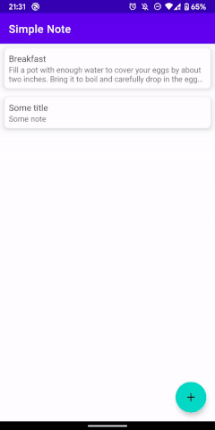
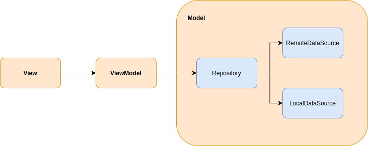

# SimpleNoteMVVM
Simple project of note for learning MVVM, Hilt, Room & more

## Tech stack 
- Kotlin + Coroutines 
- Flow - notify views about database change
- Hilt for dependency injection
- Jetpack
  - Navigation - in-app navigation
  - Lifecycle - dispose of observing data when lifecycle state changes
  - ViewModel - store and manage UI-related data in a lifecycle conscious way
- Room - store offline cache

- Architecture
  - Single activity architecture
  - MVVM architecture
  - Repository pattern
  
## Architecture

